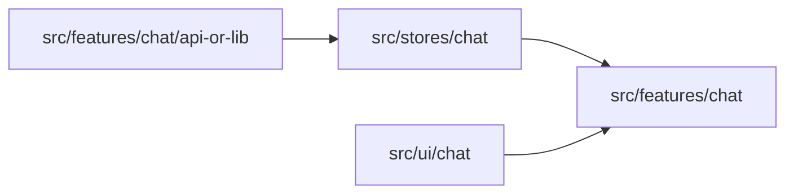

# Chat UI Integration Next

Работаем в репозитории `neuro-hub`.

Этот документ описывает следующий этап после завершения автономного chat UI-kit.

Предпосылка:
- UI-компоненты из `@/.cursor/plans/CHAT-UI-SPEC.md` уже реализованы и проверены в Playground

Вне scope этого этапа:
- редизайн UI-контракта
- переработка backend API
- расширение scope до group chat, attachments, typing, presence

## Goal

Подключить новый chat UI-kit к реальному чату приложения:

- вынести клиентское состояние чата в `src/stores/chat/*`
- адаптировать текущий `src/features/chat/*` под новый UI-kit
- сохранить текущую бизнес-логику чата, realtime и optimistic flow

## High-level direction

## What should be moved to `src/stores/chat`

Из текущего `src/features/chat/model.ts` в `src/stores/chat/*`:

- gate / open-close lifecycle chat page state
- conversations list state
- active conversation id state
- messages by conversation state
- pagination cursor state
- loading / error stores
- unread derived state
- optimistic send flow
- read sync flow
- realtime subscription lifecycle

Цель:
- `src/features/chat/*` больше не должен содержать основную Effector orchestration
- feature должен стать thin composition layer

## Proposed store shape

### `src/stores/chat/model.ts`

Базовые units:
- `$conversations`
- `$activeConversationId`
- `$activeConversation`
- `$activeMessages`
- `$activeNextCursor`
- `$conversationsError`
- `$activeMessagesError`
- `$realtimeStatus`
- `$unreadConversationsCount`

Effects/events:
- `chatConversationsRefreshRequested`
- `chatActiveConversationChanged`
- `chatActiveConversationReloadRequested`
- `chatHistoryLoadRequested`
- `chatMessageSubmitted`
- `loadChatConversationsFx`
- `loadActiveChatMessagesFx`
- `loadOlderChatMessagesFx`
- `sendChatMessageFx`
- `markChatConversationReadFx`
- realtime subscribe/unsubscribe effects

### Optional split if needed

Если файл начинает разрастаться, разбить на:
- `src/stores/chat/model.ts`
- `src/stores/chat/helpers.ts`
- `src/stores/chat/realtime.ts`
- `src/stores/chat/api.ts`

Но не дробить заранее без необходимости.

## What stays in `src/features/chat`

### `src/features/chat/page.tsx`

Остаётся route-aware entry:
- читает `conversationId` из params
- подключает gate / init entrypoint
- берёт данные из `src/stores/chat`
- собирает page-level UI

### `src/features/chat/*`

Роль feature после интеграции:
- mapping store shape -> UI props
- page/header/breadcrumb composition
- wiring `onSelect`, `onRefresh`, `onSubmit`
- layout-level decisions

Не должно оставаться:
- основного бизнес-state
- сложной `sample()` orchestration

## UI mapping tasks

После появления нового UI-kit нужно решить маппинг:

### `Chats`

- `ChatConversationSummary` -> `Chat` item props
- `lastMessage` preview formatting
- `updatedAt` formatting
- `unreadCount`
- `activeId`
- `onSelect`

### `Messages`

- `ChatUiMessage[]` -> `Message[]`
- `senderId` -> `direction`
- `createdAt` -> `timestamp`
- optimistic / failed / read state -> `Status`
- `author` пока прокидывается как future-facing prop

### `Composer`

- controlled draft state можно держать:
  - сначала в feature-local state
  - потом при необходимости в store

Рекомендуемый первый шаг:
- оставить draft в компоненте feature/composer adapter
- не усложнять store без подтверждённой причины

## Realtime and optimistic flow

Этот этап не должен менять базовую бизнес-логику:

- источник истины: server + Postgres
- flow сообщения: `client -> API -> DB -> realtime publish`
- optimistic row остаётся только UI-ускорением
- realtime subscription и read sync остаются в Effector orchestration

Нужно только отвязать эту логику от feature-specific JSX.

## Recommended migration order

1. Вынести текущий `model.ts` в `src/stores/chat/*` без изменения поведения.
2. Обновить импорты в `src/features/chat/page.tsx`.
3. Создать feature-level adapters между store data и новым UI-kit.
4. Заменить старые `workspace.tsx`, `thread.tsx`, `conversations-list.tsx`, `panel.tsx` на новый UI composition layer.
5. Проверить realtime, unread, optimistic statuses, reload, load older.
6. После стабилизации удалить устаревшие feature-specific UI pieces.

## Likely touched files

- `src/stores/chat/model.ts`
- `src/stores/chat/helpers.ts` if needed
- `src/stores/chat/realtime.ts` if needed
- `src/stores/chat/api.ts` if needed
- `src/features/chat/page.tsx`
- `src/features/chat/workspace.tsx`
- `src/features/chat/thread.tsx`
- `src/features/chat/conversations-list.tsx`
- `src/features/chat/panel.tsx`
- `src/features/chat/helpers.ts`
- `src/features/chat/realtime.ts`

Часть этих файлов может быть удалена или схлопнута после миграции.

## Risks to watch

- сломать `use client` boundary при экспорте UI-kit
- смешать store orchestration и JSX снова
- потерять optimistic `failed/sending` states при маппинге в `Message`
- потерять unread / read synchronization при переносе model
- привязать UI-kit к backend типам сильнее, чем нужно

## Verification checklist

- conversations list loads and refreshes
- opening a conversation renders correct `Chats`/`Messages` state
- sending message shows `sending -> sent/failed`
- unread badge updates correctly
- read sync still works
- realtime incoming messages still append correctly
- lint and type-check pass for touched files

## Decisions locked for this next phase

- stores выносятся отдельно от UI
- `src/features/chat` становится thin composition layer
- новый UI-kit подключается через adapters, а не через смешивание логики внутрь `src/ui/chat`
- сначала сохраняем текущее поведение, потом чистим legacy UI files
