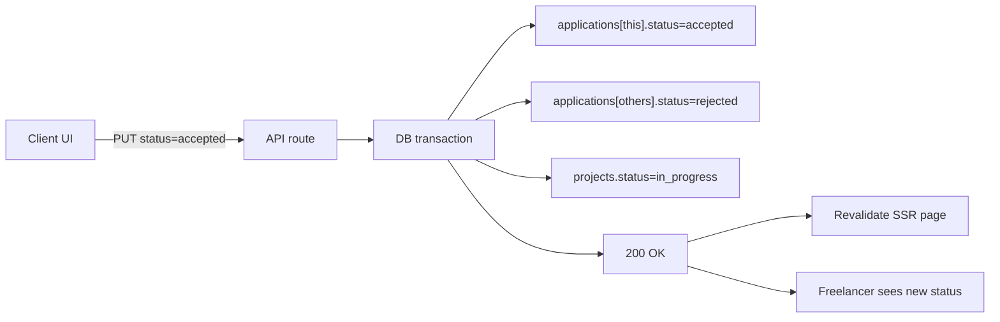

## Состояние на старте

Уже реализовано (не трогаем):
- Каталог фрилансеров [src/features/freelancers.tsx](src/features/freelancers.tsx) + `GET /api/freelancers`
- Список проектов клиента [src/features/projects/account-projects.tsx](src/features/projects/account-projects.tsx)
- Группированная страница заявок по всем проектам [src/features/projects/project-applications.tsx](src/features/projects/project-applications.tsx) + функция `listClientProjectApplications` в [src/lib/db/queries/projects.ts](src/lib/db/queries/projects.ts)
- Базовая форма создания проекта [src/features/projects/create-project-page.tsx](src/features/projects/create-project-page.tsx)
- Поля `company_name`/`company_role` в `user_profiles` (миграция 007)
- API `/api/user/profile` уже принимает клиентские поля

Отнесено в этап 6 (требует таблицы `orders`):
- Приём работы (5.5)
- Форма отзыва и рейтинга (5.5)

---

## Фаза 5A — Управление заявками (highest-value loop)

Цель: клиент может увидеть, отсортировать и принять/отклонить заявки по конкретному проекту; статус заявки корректно меняется и виден фрилансеру.

### Миграции
- `20260XXX_017_user_profiles_add_typical_tasks.ts` — `user_profiles.typical_tasks TEXT NULL` (минимум из «client_profiles» по MVP §5.1; отдельную таблицу не создаём — цена и join'ы не оправданы)
- Обновить [docs/db/schema.dbml](docs/db/schema.dbml), [docs/db/DATABASE.md](docs/db/DATABASE.md)

### Backend
- `PUT /api/applications/:id/status` — новая ручка, только для клиента-владельца проекта; валидные переходы: `submitted → shortlisted | accepted | rejected`; при `accepted` — автопереводить остальные заявки проекта в `rejected` и проект в `in_progress`
- `GET /api/projects/:id/applications` — публичный endpoint-обёртка над существующей функцией (для возможных клиентских вызовов), пагинация + sort: `created_at | proposed_price | relevance`
- Новая функция `listApplicationsByProjectForClient({projectId, clientId, sort})` в `projects.ts`
- Новая функция `updateApplicationStatusByClient(...)` с транзакцией
- Схемы в `src/lib/validations/projects.ts` — `updateApplicationStatusSchema`, `projectApplicationsQuerySchema`
- Счётчик rating у фрилансера пока = 0 (заглушка, т.к. нет `reviews`)

### UI
- `/account/projects/[id]/applications` — новая страница с детализацией заявок по одному проекту
  - Server component, owner-only
  - Sort-badges по аналогии с `/freelancers`
  - Расширить [src/features/entity-cards/application-card.tsx](src/features/entity-cards/application-card.tsx): кнопки «Принять» / «Отклонить» / «В shortlist» → клиентский wrapper-компонент с Effector-моделью и алертами через `@/alerts`
- В общей странице `/account/projects/applications` — добавить ссылки «Открыть заявки» на per-project страницу
- Обновить сайдбар [src/features/account-sidebar.tsx](src/features/account-sidebar.tsx): бейдж `~applications` для client уже привязан

### Модель (Effector)
- `src/stores/project-applications/model.ts` — `updateApplicationStatusFx`, `$pendingActionId`, оптимистичное обновление локального списка через Immer
- Домен зарегистрировать в [src/lib/logger/watched.ts](src/lib/logger/watched.ts)

### Выходные критерии фазы 5A
- Клиент может принять/отклонить/shortlist заявку
- После `accepted` проект автоматически переходит в `in_progress`, остальные заявки — в `rejected`
- Фрилансер видит новый статус на `/account/applications`
- Tests (API + model)

---

## Фаза 5B — Приглашения и избранное

Цель: клиент может пригласить фрилансера в свой проект и вести список избранных.

### Миграции
- `20260XXX_018_create_invitations.ts` — `invitations(id UUID, project_id UUID, freelancer_id TEXT, client_id TEXT, message TEXT, status ENUM[pending, accepted, declined, expired], created_at, updated_at)` с уникальным индексом `(project_id, freelancer_id)`
- `20260XXX_019_create_favorite_freelancers.ts` — `favorite_freelancers(client_id TEXT, freelancer_id TEXT, created_at, PRIMARY KEY(client_id, freelancer_id))`
- Синхронизация docs/db

### Backend
- `POST /api/invitations` — создать приглашение; клиент может пригласить только на свой `published` проект; при `accepted` — auto-create application + смена проекта в `in_progress`
- `GET /api/invitations` — список приглашений (для обеих ролей, с фильтром по статусу)
- `PUT /api/invitations/:id/status` — фрилансер принимает/отклоняет
- `POST /api/favorite-freelancers` / `DELETE /api/favorite-freelancers/:freelancerId`
- `GET /api/favorite-freelancers` — список для текущего клиента
- Query-хелперы в `src/lib/db/queries/invitations.ts` и `favorite-freelancers.ts`

### UI
- Кнопка «Пригласить в проект» на публичном профиле фрилансера [src/features/freelancer-profile/freelancer-public.tsx](src/features/freelancer-profile/freelancer-public.tsx) — модалка с select проектов клиента + textarea сообщения
- Кнопка «В избранное» (heart-toggle) на карточке фрилансера [src/features/freelancers-card.tsx](src/features/freelancers-card.tsx) и в публичном профиле
- Новая страница `/account/favorites` — grid карточек избранных фрилансеров (вместо текущего `pending`)
- Обновить сайдбар: "Избранные фрилансеры" → реальная ссылка
- Для фрилансера: вкладка приглашений в `/account/applications` или отдельная `/account/invitations`

### Выходные критерии фазы 5B
- Клиент может пригласить фрилансера и видеть историю приглашений
- Фрилансер видит входящие приглашения и может принять/отклонить
- Избранное работает с оптимистичной hover-кнопкой

---

## Фаза 5C — Полноценный wizard создания проекта

Цель: клиент проходит полноценный multi-step wizard создания проекта, может описать проект с markdown, прикрепить файлы ТЗ, предпросмотреть результат и сохранить шаблон. Детальная UX-структура wizard будет уточнена пользователем отдельно на основе примеров.

### Миграции
- `20260XXX_020_create_project_templates.ts` — `project_templates(id UUID, client_id TEXT, template_name VARCHAR, template_data JSONB, created_at, updated_at)` с индексом по `client_id`
- Для attachments таблица `project_attachments` уже есть; нужен Blob-upload endpoint `POST /api/blob/project-attachment-upload` по аналогии с [src/app/api/blob/portfolio-upload/route.ts](src/app/api/blob/portfolio-upload/route.ts)

### Backend
- `GET/POST /api/project-templates`, `DELETE /api/project-templates/:id`
- Схема `projectTemplateInputSchema = fullProjectSchema.partial().pick(...)`
- Перенос fullProjectSchema в template_data (JSONB)

### UI — полноценный wizard
Работа в [src/features/projects/create-project-page.tsx](src/features/projects/create-project-page.tsx) и её модели:
- Переписать форму в multi-step flow: базовые данные → описание и требования → бюджет → сроки → вложения → preview/publish
- Архитектуру wizard сделать расширяемой: отдельные step-компоненты, общий Effector model/state machine, валидация шага перед переходом
- Markdown-textarea для description с live-preview (переиспользовать существующие markdown-утилиты из `@/utils`, см. MarkdownRender)
- Drag-and-drop аплоад файлов ТЗ через существующий `FileUploader` из `@/ui` → Vercel Blob → в `form.attachments`
- Preview проекта как отдельный финальный step или модалка; точный UX определяется после дополнительного описания от пользователя
- «Сохранить как шаблон» + «Загрузить из шаблона» встроить в wizard без разрушения step-state
- Обновить `create-project-model.ts`: добавить state по шагам, `$attachments`, `$templates`, `loadTemplateFx`, `saveAsTemplateFx`, переходы `next/back/goToStep`

### Выходные критерии фазы 5C
- Markdown-описание рендерится корректно на странице проекта
- Клиент аплоадит файлы ТЗ и они видны на `/projects/[id]`
- Шаблоны сохраняются и загружаются в форму
- Wizard покрывает весь flow создания проекта до публикации
- Preview перед публикацией

---

## Кросс-фазовые задачи

- Обновлять [docs/db/schema.dbml](docs/db/schema.dbml), [docs/db/DATABASE.md](docs/db/DATABASE.md), `docs/db/queries/*.sql` после каждой миграции
- Обновлять чек-боксы в [DEVELOPMENT-PLAN.md](DEVELOPMENT-PLAN.md) по завершении каждой фазы
- Весь scope этапа 5 зафиксирован в этой итерации; фазы 5A/5B/5C остаются внутренним порядком реализации
- Для 5C перед стартом UI-реализации дождаться от пользователя более точного описания wizard и примеров
- Каждая фаза = отдельный PR; между фазами — пауза для ревью
- Пункт «Экран персональных рекомендаций» (2.3) и этап 6 остаются за рамками

## Flow «accept application»

