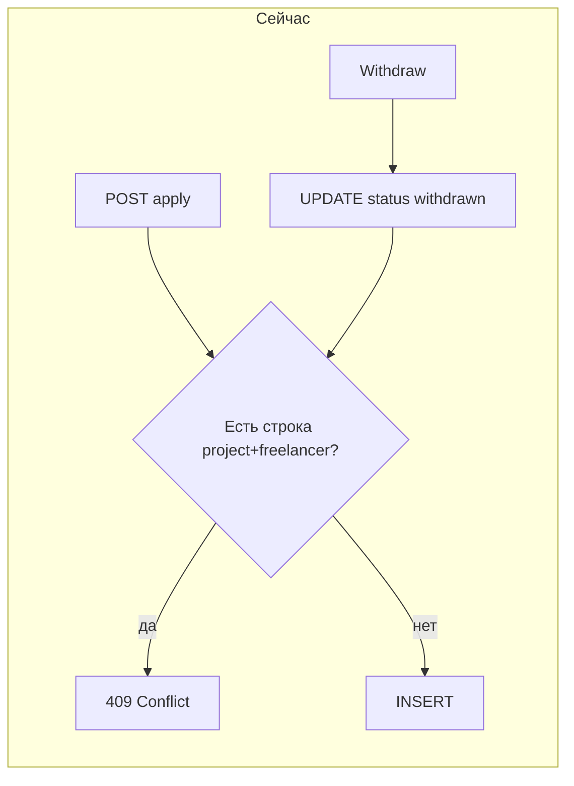

# Повторная заявка на проект после отзыва

## Почему так сейчас

**1. База данных** — в миграции на таблицу `applications` задано уникальное ограничение на пару `(project_id, freelancer_id)`:

```80:80:src/lib/db/migrations/20260317_014_create_projects_and_applications.ts
        table.unique(['project_id', 'freelancer_id'])
```

Отзыв заявки **не удаляет** строку, а только меняет `status` на `withdrawn` (`[withdrawApplicationForFreelancer](src/lib/db/queries/projects.ts)`).

**2. Создание заявки** — перед `INSERT` выбирается любая существующая строка по проекту и фрилансеру; если она есть — выбрасывается `ConflictError`, без учёта статуса:

```550:559:src/lib/db/queries/projects.ts
    const existing = await kysely
        .selectFrom('applications')
        .select(['id'])
        .where('project_id', '=', projectId)
        .where('freelancer_id', '=', freelancerId)
        .executeTakeFirst()

    if (existing) {
        throw new ConflictError('Заявка на этот проект уже подана')
    }
```

Даже без этой проверки второй `INSERT` упрётся в тот же unique constraint.

**3. Страница проекта** — форма показывается только если **нет** `viewerApplication`. Заявка подгружается без фильтра по статусу, поэтому отозванная заявка всё равно приходит и блокирует подачу:

```325:331:src/lib/db/queries/projects.ts
    const viewerApplication = viewerUserId
        ? await kysely
                .selectFrom('applications')
                .select(['id', 'status', 'created_at as createdAt'])
                .where('project_id', '=', projectId)
                .where('freelancer_id', '=', viewerUserId)
                .executeTakeFirst()
        : null
```

```37:38:src/features/projects/project.tsx
    const isExpired = project.deadline.getTime() <= Date.now()
    const canApply = session?.user.role === 'freelancer' && !project.viewerApplication && !isExpired
```

Итого: после отзыва в БД остаётся одна строка со статусом `withdrawn`, API не даёт создать вторую, UI не показывает форму.



---

## Варианты реализации повторной подачи

### Вариант A — «Реактивация» той же строки (рекомендуемый по простоте миграций)

- В `[createProjectApplicationForFreelancer](src/lib/db/queries/projects.ts)`: если найденная заявка в статусе `withdrawn`, выполнить **UPDATE**: новые поля (`cover_letter`, `proposed_price`, `proposed_deadline`), `status = 'submitted'`, `updated_at = now()` (продуктово решить, трогать ли `created_at` — если показываете «дата подачи», логичнее обновить на момент повторной подачи).
- Unique constraint **не менять**.
- UI: для `canApply` считать, что **отозванная** заявка не блокирует подачу — либо расширить условие в `[project.tsx](src/features/projects/project.tsx)` (например разрешить форму при `viewerApplication?.status === 'withdrawn'`), либо в `[getPublicProjectById](src/lib/db/queries/projects.ts)` отдавать для сайдбара «активную» заявку отдельно от «последней любой» (чтобы текст карточки и кнопки оставались понятными).

**Плюсы:** без миграции схемы, одна заявка на пару в БД, клиенты не видят дубликатов по фрилансеру.  
**Минусы:** нет отдельной истории «первая подача / отзыв / вторая подача» в виде нескольких строк (только `updated_at`/аудит при необходимости).

### Вариант B — Удаление строки при отзыве

- В `[withdrawApplicationForFreelancer](src/lib/db/queries/projects.ts)`: вместо `UPDATE` — `DELETE` (или soft-delete отдельным флагом, если появится).
- Проверка в `create` и unique остаются как сейчас; после отзыва `viewerApplication` станет `null` при следующей загрузке.

**Плюсы:** минимальные изменения в `create`.  
**Минусы:** заявка со статусом «отозвана» **исчезнет** из `[listFreelancerApplications](src/lib/db/queries/projects.ts)` / экрана «Мои заявки» — сейчас отозванные там отображаются; это заметная потеря истории для фрилансера.

### Вариант C — Новая строка при каждой подаче (полная история)

- Убрать глобальный `UNIQUE(project_id, freelancer_id)`, добавить **частичный уникальный индекс** в PostgreSQL только для «активных» статусов (например `submitted`, `shortlisted`), чтобы нельзя было иметь две одновременно активные заявки; при `withdrawn`/`rejected` можно вставлять новую строку.
- Логику `create` переписать под «если есть активная — конфликт; иначе INSERT».
- Запросы клиента к списку кандидатов (если есть) должны фильтровать по статусу — нужно проверить все места чтения `applications`.

**Плюсы:** полная история подач и отзывов.  
**Минусы:** миграция БД, больше мест для согласованности (индекс, все селекты, возможные дубликаты `freelancer_id` в выборках для клиента).

---

## Рекомендация для обсуждения

- Если важна **история отозванных** в кабинете фрилансера и не нужны несколько физических строк — **вариант A** (reactivate одной строки, при необходимости скорректировать отображаемую «дату подачи»).
- Если история отозванных не важна — **вариант B** самый короткий, но осознанно ломает текущий UX списка заявок.
- Если позже понадобится аналитика «сколько раз подавал» — **вариант C**.

---

## Файлы, которые точно затронет любая осмысленная реализация

| Область                | Файл                                                                                                                                                         |
| ---------------------- | ------------------------------------------------------------------------------------------------------------------------------------------------------------ |
| Бизнес-логика создания | `[src/lib/db/queries/projects.ts](src/lib/db/queries/projects.ts)` (`createProjectApplicationForFreelancer`; при B — ещё `withdrawApplicationForFreelancer`) |
| Отображение проекта    | `[src/features/projects/project.tsx](src/features/projects/project.tsx)` (`canApply` и ветка с `viewerApplication`)                                          |
| Данные для страницы    | `[src/lib/db/queries/projects.ts](src/lib/db/queries/projects.ts)` (`getPublicProjectById` — при необходимости разделить «активная» / «любая» заявка)        |
| При варианте C         | новая миграция Knex + обновление `[src/types/database.ts](src/types/database.ts)` при изменении индексов                                                     |

Дополнительно: при изменении поведения стоит добавить тесты на уровень запросов или API (сейчас по grep **нет** тестов на `createProjectApplicationForFreelancer` / дубликат / withdraw).

---

## Вопрос к тебе перед реализацией

Нужна ли **сохранённая история** отозванных заявок в «Мои заявки» как отдельные события, или достаточно одной записи, которая после повторной подачи снова становится «подана» (вариант A)?
