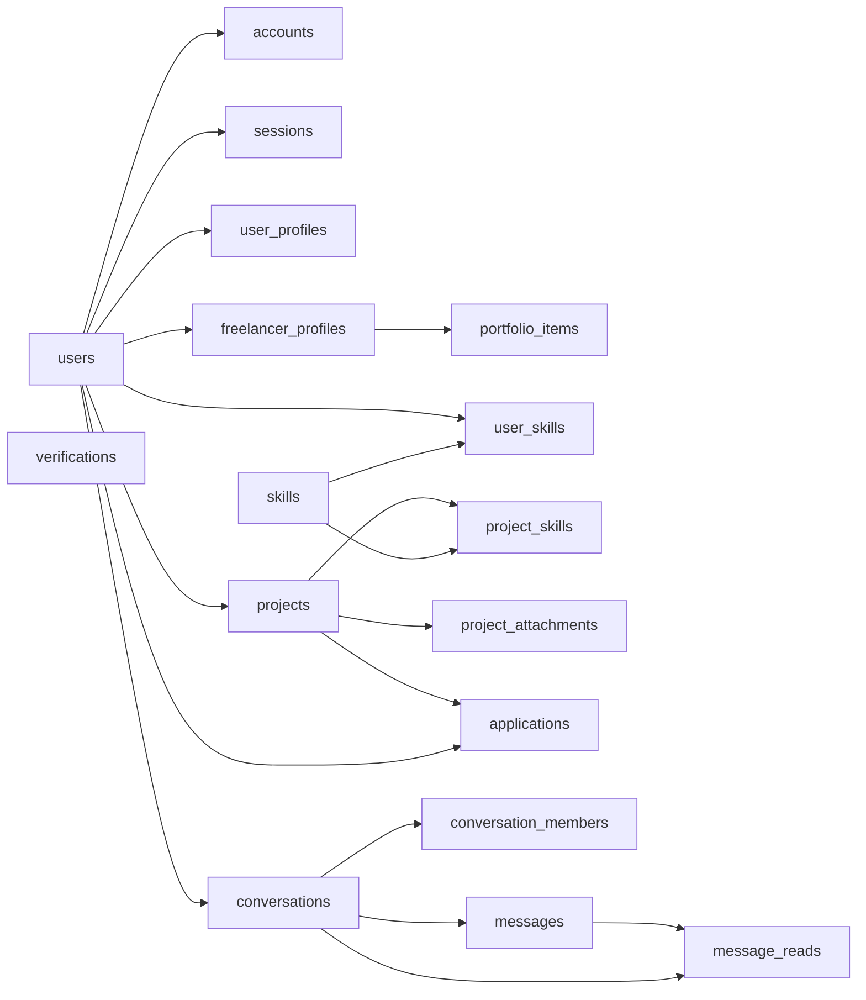

# DATABASE

## Scope

This is the current draft of database documentation for product tables plus auth support tables.

Included:

- `accounts`, `sessions`, `verifications`
- `users` as the base identity reference for product relations
- `user_profiles`, `freelancer_profiles`
- `portfolio_items`
- `skills`, `user_skills`, `project_skills`
- `projects`, `project_attachments`, `applications`
- `conversations`, `conversation_members`, `messages`, `message_reads`

Not included yet:

- `knex_migrations`, `knex_migrations_lock`

## Purpose

The product schema supports five main areas:

- auth identity and session support
- marketplace identity and public representation
- freelancer portfolios and normalized skills
- client projects and freelancer applications
- contextual two-party chat between customer and freelancer

## Source Of Truth

- Physical schema in repo: `docs/db/schema.dbml`
- Canonical SQL examples: `docs/db/queries/`
- Actual runtime schema: PostgreSQL database plus migrations in `src/lib/db/migrations`
- Verification method: Postgres MCP resources and read-only SQL queries

Current canonical SQL examples:

- `docs/db/queries/auth-overview.sql`
- `docs/db/queries/user-auth-state.sql`
- `docs/db/queries/auth-diagnostics.sql`
- `docs/db/queries/freelancer-public-profile.sql`
- `docs/db/queries/project-details.sql`
- `docs/db/queries/project-owner-details.sql`
- `docs/db/queries/user-skills.sql`
- `docs/db/queries/conversation-thread.sql`

When docs and the live database differ, treat the live database and migrations as the stronger signal, then update these docs.

## Domain Map

## Core Domains

### Identity Base

#### `users`

Purpose: base account entity referenced by product tables.

Key fields:

- `id`: canonical user identifier used across product relations
- `email`: unique login identifier
- `role`: application role used by business logic

Notes:

- `users` is the anchor for both product relations and auth support tables

### Auth Support

#### `accounts`

Purpose: provider binding and credential/account metadata managed by Better Auth.

Key fields:

- `accountId`
- `providerId`
- `userId`
- `accessToken`, `refreshToken`, `idToken`
- `accessTokenExpiresAt`, `refreshTokenExpiresAt`
- `scope`

Invariants:

- every account row belongs to one user
- token fields are sensitive and should not be selected casually in application queries

Canonical usage:

- use for auth/provider troubleshooting and account linkage
- avoid using this table in regular product read models unless auth/provider metadata is explicitly needed

#### `sessions`

Purpose: active and historical Better Auth sessions.

Key fields:

- `token`
- `userId`
- `expiresAt`
- `ipAddress`
- `userAgent`

Invariants:

- every session belongs to one user
- `token` is unique and sensitive

Canonical usage:

- use for session diagnostics, revocation, and auth lifecycle work
- avoid selecting raw session tokens outside security-sensitive flows

#### `verifications`

Purpose: auth verification artifacts such as codes, magic-link state, or token-like payloads.

Key fields:

- `identifier`
- `value`
- `expiresAt`

Invariants:

- values are sensitive
- this table is not linked to `users` by a foreign key in the current schema

Canonical usage:

- use only for auth verification workflows and troubleshooting
- do not treat `identifier` as a guaranteed user id without checking the auth flow semantics

### Profiles

#### `user_profiles`

Purpose: editable base profile shared across marketplace use cases.

Key fields:

- `user_id`: one-to-one link to `users`
- `nickname`: unique public slug (lowercase) used in `/freelancers/{nickname}` URLs
- `name`, `avatar_url`, `bio`: public presentation fields
- `location`: optional free-text location shown on profile when set
- `company_name`, `company_role`: company-related profile metadata
- `search_vector`: generated search field for full-text lookup (includes name, nickname, location, bio)

Invariants:

- one `user_profiles` row per `users` row at most
- `nickname` is unique and treated as the public identifier for user-level profile data in URLs
- `search_vector` is derived, not user-authored

Canonical usage:

- use this table for general profile data that is not freelancer-specific
- do not write application logic against `search_vector` as if it were a user-managed field

#### `languages`

Purpose: lookup of ISO-like language codes with display names for profile language lists.

Key fields:

- `code` primary key (short string, e.g. `en`, `ru`)
- `name`, `native_name`: English and native labels
- `sort_order`: stable ordering in UI and queries

#### `user_languages`

Purpose: languages spoken by a user with proficiency level.

Key fields:

- composite primary key `(user_id, language_code)`
- `lang_level`: one of `basic`, `conversational`, `fluent`, `native`

Invariants:

- `language_code` must exist in `languages`
- at most one row per `(user_id, language_code)`

#### `freelancer_profiles`

Purpose: freelancer-only public/work profile for the marketplace.

Key fields:

- `user_id`: one-to-one link to `users`
- `specialization`, `hourly_rate`, `availability`, `experience`: freelancer-facing summary

Invariants:

- one `freelancer_profiles` row per user at most
- portfolio ownership is attached to `freelancer_profiles`, not directly to `users`

Canonical usage:

- use this table as the owner of portfolio items
- use this table as the public freelancer representation layer

### Portfolio

#### `portfolio_items`

Purpose: showcase entries for a freelancer profile.

Key fields:

- `freelancer_profile_id`: canonical owner reference
- `title`, `description`: content fields
- `media_url`, `media_type`: primary media payload
- `tools_used`: flexible metadata about tools used in the project
- `media_width`, `media_height`, `caption`: gallery/display metadata

Invariants:

- every portfolio item belongs to exactly one `freelancer_profiles` row
- ownership must be resolved through `freelancer_profile_id`

Canonical usage:

- join `portfolio_items` through `freelancer_profiles`, then to `users` if user identity is needed
- do not reintroduce direct ownership by `user_id`

### Skills

#### `skills`

Purpose: normalized skill catalog used across users and projects.

Key fields:

- `id`: canonical UUID identifier
- `name`: unique display name
- `category`: current classification field
- `legacy_id`: preserved historical identifier from the UUID migration

Invariants:

- `id` is the only canonical key for new relations
- `name` is unique

Canonical usage:

- reference `skills.id` from relation tables
- treat `legacy_id` as migration/debug data only

#### `user_skills`

Purpose: many-to-many link between users and skills.

Key fields:

- `user_id`
- `skill_id`
- `proficiency_level`
- `legacy_skill_id`

Invariants:

- one user can reference a given skill only once
- `skill_id` is the canonical foreign key

Canonical usage:

- for user skill lists, join `user_skills` to `skills` by `skill_id`
- do not use `legacy_skill_id` for business logic

#### `project_skills`

Purpose: many-to-many link between projects and required skills.

Key fields:

- `project_id`
- `skill_id`

Invariants:

- composite primary key is `(project_id, skill_id)`

Canonical usage:

- use this table as the only normalized source of project skill requirements

### Marketplace

#### `projects`

Purpose: client project brief published in the marketplace.

Key fields:

- `client_id`: owner in `users`
- `title`, `description`, `category`
- `experience_level`
- `budget_type`, `budget_min`, `budget_max`
- `deadline`
- `status`
- `cover_url`: optional URL for a project cover image (or other media) used in listing and detail UIs; nullable when unset. Mock seeds: `MOCK-PROJECTS.md` uses `/mock-projects/cover-*.jpg` (JPEG Q60, 16:9), keyed by the last 4 id hex digits

Invariants:

- every project belongs to one client
- budget is stored as min/max range rather than a single value

Canonical usage:

- start from `projects` for any project-centric read model
- join attachments, skills, and applications outward from `projects`

#### `project_attachments`

Purpose: file attachments for a project brief.

Key fields:

- `project_id`
- `filename`, `file_url`
- `mime_type`, `file_size_bytes`

Agent note: `mime_type` reflects the asset (e.g. `image/jpeg`, `application/pdf`, OOXML for `.docx`, `video/mp4`, `audio/mp3` for `.mp3`); mock seeds in `MOCK-PROJECTS.md` mix types for QA.

Invariants:

- every attachment belongs to one project

Canonical usage:

- treat as dependent project resources, never as standalone assets

#### `applications`

Purpose: freelancer proposals submitted to projects.

Key fields:

- `project_id`
- `freelancer_id`
- `cover_letter`
- `proposed_price`
- `proposed_deadline`
- `status`

Invariants:

- one freelancer can submit at most one application per project
- each application belongs to one project and one freelancer

Canonical usage:

- project view: start from `projects`, then join `applications`
- freelancer dashboard: start from `applications`, then join `projects`

### Chat

#### `conversations`

Purpose: contextual chat container for a customer and a freelancer.

Key fields:

- `context_type`, `context_id`: bind the conversation to a domain context
- `customer_id`, `freelancer_id`: the two parties
- `created_by`: initiator

Invariants:

- a conversation is unique per `(context_type, context_id, customer_id, freelancer_id)`
- current schema models two-party conversations only

Canonical usage:

- resolve chat threads by domain context first, then participants
- do not infer participants only from `conversation_members` if context uniqueness matters

#### `conversation_members`

Purpose: explicit membership records for conversation participants.

Key fields:

- `conversation_id`
- `user_id`
- `role`

Invariants:

- each user appears once per conversation at most
- each role appears once per conversation at most

Canonical usage:

- use for membership checks and participant listing
- rely on `role` as conversation-local semantics, not as a global user role

#### `messages`

Purpose: immutable message stream inside a conversation.

Key fields:

- `conversation_id`
- `sender_id`
- `text`
- `created_at`

Invariants:

- every message belongs to one conversation
- message ordering is timestamp-oriented, with `(conversation_id, created_at, id)` index support

Canonical usage:

- paginate within a conversation using `created_at` and `id`

#### `message_reads`

Purpose: per-user read cursor for conversations.

Key fields:

- `conversation_id`
- `user_id`
- `last_read_message_id`
- `last_read_message_created_at`
- `read_at`

Invariants:

- one read-state row per user per conversation
- read progress points to a concrete message row

Canonical usage:

- use this table as the source of unread/read cursor state
- do not derive read state by scanning messages ad hoc if this table is available

## Canonical Relationships

- `users` -> `user_profiles`: `1:0..1`
- `users` -> `accounts`: `1:N`
- `users` -> `sessions`: `1:N`
- `users` -> `freelancer_profiles`: `1:0..1`
- `freelancer_profiles` -> `portfolio_items`: `1:N`
- `users` -> `user_skills`: `1:N`
- `skills` -> `user_skills`: `1:N`
- `users` -> `projects`: `1:N` as client
- `projects` -> `project_skills`: `1:N`
- `skills` -> `project_skills`: `1:N`
- `projects` -> `project_attachments`: `1:N`
- `projects` -> `applications`: `1:N`
- `users` -> `applications`: `1:N` as freelancer
- `conversations` -> `conversation_members`: `1:N`
- `conversations` -> `messages`: `1:N`
- `conversations` -> `message_reads`: `1:N`
- `messages` -> `message_reads`: `1:N` by read cursor reference

## Lifecycle Rules

- `users` exists before any product profile or marketplace entity
- auth support rows in `accounts` and `sessions` depend on `users`
- `user_profiles` is the base editable profile layer
- `freelancer_profiles` should exist before creating `portfolio_items`
- `skills` should be created before linking them in `user_skills` or `project_skills`
- `projects` should exist before attachments, required skills, applications, or context-bound conversations are created
- `conversations` should exist before `conversation_members`, `messages`, and `message_reads`

## Query Conventions

- For public freelancer data:
start from `freelancer_profiles`, then join `users` and `portfolio_items`
- For auth overview:
keep it safe/general and summarize providers plus active session state without diagnostic fields
- For auth diagnostics:
start from `users`, then join `accounts` and `sessions` only if the task explicitly requires provider/session diagnostics
- For current auth state:
use active `sessions` semantics explicitly rather than mixing current state with historical diagnostics
- For general profile lookups:
start from `user_profiles`
- For user skills:
join `user_skills` -> `skills` using `skill_id`
- For project details:
use `project-details.sql` for the public/general project read model
- For owner/internal project details:
use `project-owner-details.sql` when application pipeline fields are required
- For chat state:
treat `conversations` as the root, `messages` as the ordered stream, and `message_reads` as the read cursor
- For thread examples:
show deterministic message ordering and note pagination/cursor loading for long histories

## Legacy And Derived Fields

- `skills.legacy_id`: migration-era carryover, not for new relations
- `user_skills.legacy_skill_id`: migration-era carryover, not for new relations
- `user_profiles.search_vector`: generated search field, not user-authored business data

These fields are intentionally documented because they exist in the live schema and may confuse agents if omitted.

## Sensitive Fields

- `accounts.accessToken`
- `accounts.refreshToken`
- `accounts.idToken`
- `accounts.password`
- `sessions.token`
- `verifications.value`

These fields should not be logged, copied into docs examples, or selected in routine diagnostic queries unless the task is explicitly security/auth related.

## Agent Notes

When an agent works with the database, prefer this order:

1. Read `docs/db/DATABASE.md` for business meaning and invariants
2. Read `docs/db/schema.dbml` for the current structural map
3. Verify details such as nullability, defaults, and actual columns against Postgres MCP
4. Treat legacy and generated fields as technical details unless the task is migration or search related
